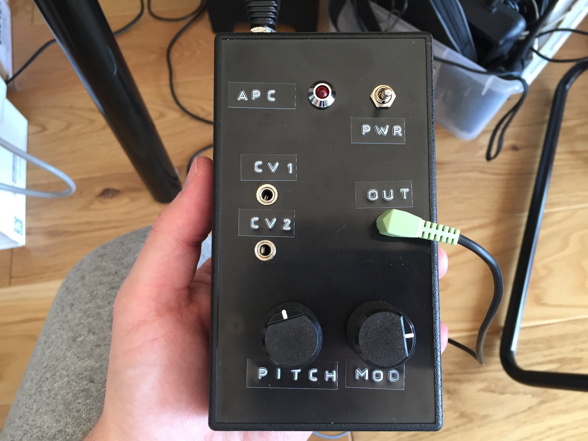
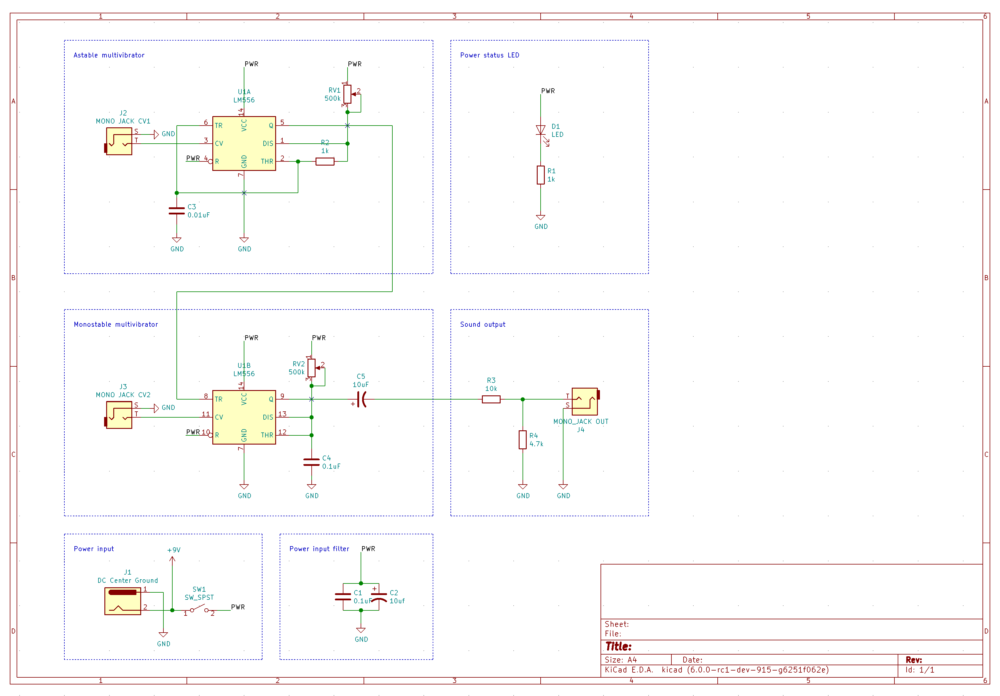
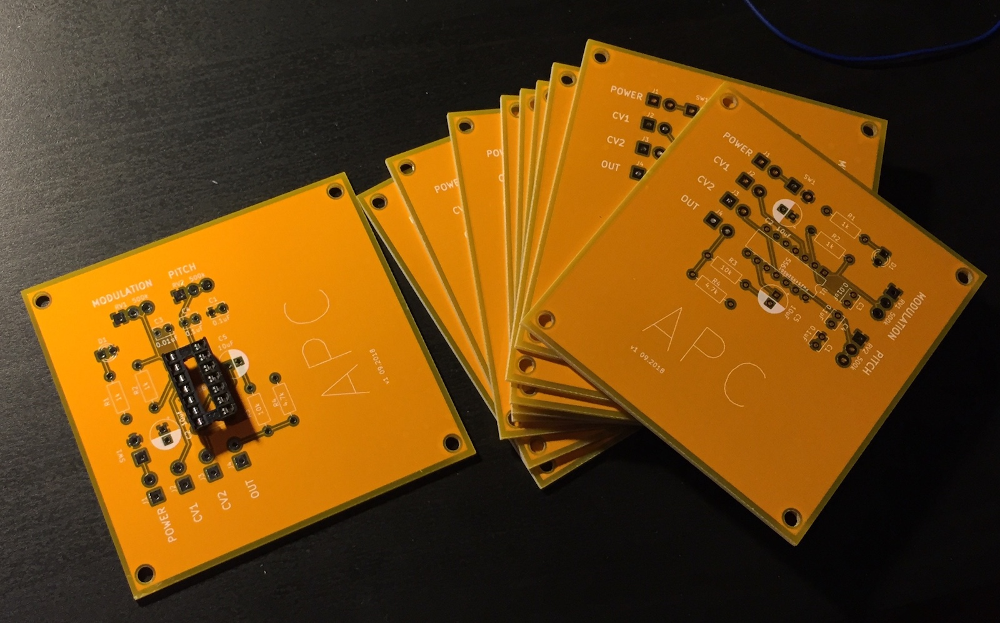
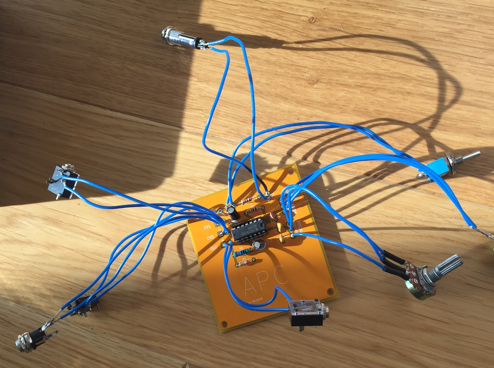

# Atari Punk Console

> With voltage control inputs



Once upon a time I was bored and decided to try something new. Ordering a bunch
of PCBs from China seemed novel enough, and so my quest began.

I chose to go with [APC](https://en.wikipedia.org/wiki/Atari_Punk_Console) as
it is super simple to build and does very characteristic noises, so it would be
very easy to identify problems with the circuit even without an oscilloscope.



You will need [KiCAD](http://kicad-pcb.org/) if you with to view the schematics,
but you can just straight up download `gerbers.zip` and use that to have your
own batch of PCBs made. That's exactly the same zip file I used to make mine,
so I'm reasonably confident it should not be broken.



For manufacturing I chose to go with PCBway, mostly because every DIY youtuber
ran at least one ad for them at some point.

Here is my referral link, if you haven't signed up for PCBway yet:
https://www.pcbway.com/setinvite.aspx?inviteid=254952



I can't really provide any concrete part numbers for connectors, as I just got
whatever was available at the local electronics store, but here's a list anyway:

```
Qty Item
1   LM556 IC
2   500k potentiometer
3   Mono audio jack
1   Center ground DC barrel jack (the ones used on guitar pedals)
1   LED
2   1k resistor
1   4.7k resistor
1   10k resistor
1   0.01uF capacitor
2   0.1uF capacitor
2   10uF electrolytic capacitor
1   SPST switch
```
